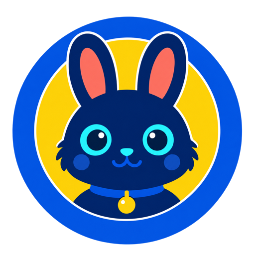

  

  

<em>Build, learn, share.</em>

<picture>
  <source media="(prefers-color-scheme: dark)" srcset="https://raw.githubusercontent.com/itgsklab/itgsklab/output/github-contribution-grid-snake-dark.svg" />
  <source media="(prefers-color-scheme: light)" srcset="https://raw.githubusercontent.com/itgsklab/itgsklab/output/github-contribution-grid-snake.svg" />
  
</picture>

- 👋 我是郭同学，一名关注实际落地的全栈开发者
- 🌱 主要学习与实践 Java、Python、Web 应用和 AI Agent
- 🤖 关注工具调用、RAG、上下文编排与 AI 辅助开发
- 🔭 正在维护 [Sikang Lab](https://github.com/itgsklab/sikangLab)，记录工程实践与技术思考
- 📕 我的技术积累站：[itgsklab.github.io/sikangLab](https://itgsklab.github.io/sikangLab/)
- ♟️ 业余喜欢围棋、烹饪，也喜欢研究能真正提高效率的工具
- 🐦 X：[@TheOrange991105](https://x.com/TheOrange991105)
- 📕 小红书：[郭同学在coding](https://xhslink.cn/o/8FbJHk34M95)
- 📫 Email：[guosikang115@163.com](mailto:guosikang115@163.com)
